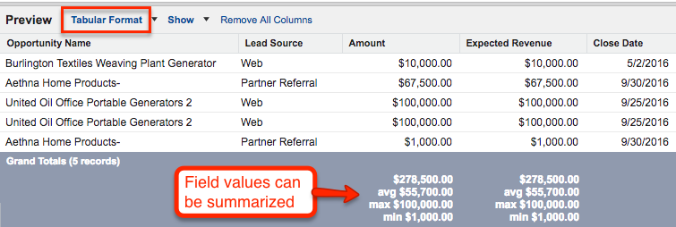
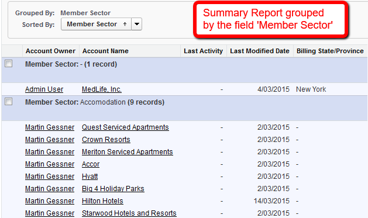

# Analytics – Reports and Dashboards (10%)

### Report Builder features:
* A report type can be selected and it determines the records and fields that appear in the report.
* One of four report formats can be used to display the data.
* Report data can be grouped in columns or rows in summary, matrix, and joined reports to display meaningful information.
* The Fields pane of the Report Builder displays fields from the selected report type, organized by folder.
* Report data can be summarized by adding a summary field.
* Charts can be used to show report data graphically.
* Other features supported by the Report Builder include bucket fields and conditional highlighting

### Report Types:
* Report types decide which records are included in the report and also what fields can be used in the report.
* Custom report types can be used to show related records with varied relationships, e.g., accounts with or without contacts, accounts without contacts, etc.

### Report formats:

* Tabular Report: 
  * List of records and the fields selected from the objects chosen in the report type.
  * Field data values can be summarized.
  * Limitations: Unable to group data. Unable to create charts. Can only be used in dashboard components when rows are limited
  

* Summary Report:
  * Allow grouping of rows of data and display of subtotals.
  * 3 levels of grouping can be defined.
  * Summary reports allow the creation of charts.
  *Summary reports can be used as the source for a dashboard component.
  

* Matrix Report 
  * Matrix reports allow grouping and summarization by rows and columns.
  * 2 levels of summarization are available for rows and columns.
  * It is useful to compare related totals and analyze a large amount of data.
  * Matrix reports can be used as the source for a dashboard component.
  

* Joined Report
  * Allow the viewing of different types of information side-by-side in one report.
  * It can contain information from multiple standard or custom report types.
  * Up to five report blocks can be added to a joined report.
  * Bucket fields, cross filters, and ‘Rows to Display’ filters are not supported in joined reports.
  * Examples of joined reports include Sales Rep Performance Scorecard, Support Cases By Status with different blocks for New and Closed Cases, Opportunity Pipeline Report with blocks for different opportunity statuses, etc.

* Report Fields:
  * All fields from the source objects are available
  * With custom report types, fields from related objects can be included.
  * Fields show with Field Label and cannot be customized unless done as part of a custom report type.
  * Additional custom fields can be defined in the report, including Bucket Fields, Summary Fields and Formula Fields.

*Row-Level Formulas
  * A row-level formula can be created for a report which requires specific information that is not available in a standalone field.
  * Only one row-level formula can be created per report.
  * Up to three unique fields can be referenced.
  * The following are supported by row-level formulas: summaries, picklist fields, conditional formatting, report charts, formatted report export, and report subscriptions.
  * Dashboard components support row-level formulas.
