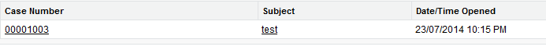
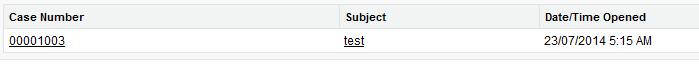

# Organization Setup 3% 
## Company Profile:

### Language Settings:
The Default Language is set on the Company Settings Page and will be applied to new users. There are 3 Levels of language support are provided:
* Fully Supported: Fully supported languages means all Salesforce features.
* End User: These languages will have translations for all standard object field labels and pages but not Setup and Help. 
* Platform: For these languages, it is possible to provide translations for customizations and standard fields. If translations are not provided, labels fall back to English.

### Locales:
Locale controls the language and format of date and time, address, currency, name and number fields.
* Defaults: Company defaults are set on the Company Settings Page. New users use the company default settings.
* Personal Settings: Users can override company default locale settings. 

### Time Zone: 
Time and Date fields will display according to the time zone setting.
* Organization Time Zone: The Organization Time Zone is set on the Company Settings page. Used as the default for new users.
* User Time Zone: Users can set their own Time Zone which will override the organization setting. 

Time and Date fields will display according to the user’s time zone setting. In the examples below, one user sees the case was opened at 10:15 pm and the other at 5:15 am, as they have different time zone settings.

### Currencies:
Organizations can be either single or multi-currency. Single Currency is the default.
* Single Currency: Single currency organizations can set the organization-wide currency on the Company Settings page using the Currency locale.
* Multi Currency: 
    * Multi-currency adds the ability to record amounts in different currencies on records. 
    * Must be enabled on the Company Settings page. 
    * In multi-currency organizations, the corporate currency is defined. 
    * An administrator can enable multi-currency, unless Customizable Forecasting is enabled.
    * Currencies must be made active for them to be used.
    * Manage Currencies allows the exchange rates between active currencies to be set.

### Organization ID:

* The Salesforce Organization ID is a unique 15 character identifier that identifies each Salesforce organization and is different for each Salesforce Org.
* The Org ID is found on the Company Settings page.
* The Org ID will be different across environments (e.g. Development, Test and Production).

### License:
Licenses are assigned to users to grant access to features. Total, used and remaining licenses are displayed on the Company Settings page.
* User Licenses: Define the baseline of features available to a user. Each user must be assigned one license. 
* Feature Licenses: Grants access to additional features that are not included in a standard license, such as Marketing, Knowledge or CRM Content. 
[Licenses Overview](https://help.salesforce.com/articleView?id=users_licenses_overview.htm&type=5)

### Business Hours and Holidays:
* Business Hours are used in Case Escalation Rules and Entitlement Processes to determine when to escalate a Case or when an Entitlement Milestone is reached.
* Multiple Business Hours can be defined with one used as the default.
* Holidays will be excluded from the time used when calculating a case escalation.

### Fiscal Year Configuration:
The business year of the company is also referred as the accounting year, taxation year, financial year or the budget year.
* Standard Fiscal Year: Standard fiscal years follow the Gregorian calendar (e.g. 12 months structure) and can be configured to start on the first day of any month and be named for the starting or ending year.
* Custom Fiscal Year: Custom fiscal years can be defined using custom periods and can be based on an existing template or an existing template can be modified. 
    * Custom fiscal years will impact forecasting, reports and quotas.
    * Once enabled, custom fiscal years cannot be deactivated, but it can follow the standard 12 month structure.
    * After enabling custom fiscal year, all existing forecasts and quotas from the first period of that year forward will be deleted, but forecasts for periods before the first custom fiscal year are not deleted.

### Data and File Storage:
* Data storage: Used by creating records (e.g. Account records, Contact records, Opportunity records). 
* File Storage: File storage is used by storing files in Attachments, the Documents tab, the Files tab, Content, Chatter (including user photos), and Site.com assets. 
* Limit: Enterprise Edition provides 10 GB of data storage / 20MB per user.

### API:
Salesforce API allows access to Salesforce programmatically, instead of using the user interface.
* Availability: It is available for Enterprise, Unlimited, Developer, and Performance editions.
* Limits: The number of API requests that can be made in a 24 hour period based on edition and number of user licenses.
* Monitoring: API usage can be monitored from the Company Settings page.

# Review

### What do locale settings impact?
Format of Date, Time, Number, Phone Number, Name and Address fields

### What do business hours and holidays impact?
Business hours and holidays are used in calculations to determine when to escalate a case or when an entitlement milestone is reached.

### What are the options to define fiscal years?
Standard or custom fiscal years. Standard fiscal years are based on a monthly structure and can start on any month. Custom Fiscal years can use a different structure such as quarters.

### What level of language support does Salesforce provide and how is a user's language setting controlled?
Salesforce offers a number of Fully Supported, End User and Platform Only languages. The language on the Company Settings page is applied to new users, but it can be overriden in My Settings.

### What is the Salesforce API?
The API is a way of accessing Salesforce programmatically and is used by Data Loading and Integration tools.

### What is the organization ID?
A unique 15 character identifier that identifies each Salesforce organization and is different in each environment.

### What time zone is used for new users?
The time zone for new users is set using default time zone on the Company Settings page, but users can override it in My Settings.

### Why would multi-currency be used?
Multi-currency is used to be able to record amounts in different currencies on records and be able to forecast and report in one corporate currency.

### Why would advanced currency management be used?
Advanced currency management allows dated exchange rates to be recorded to track the amounts when opportunities were closed.

### What are the two types of licenses?
User and Feature. User licenses define the baseline of features a user can access. Feature licenses grant additional access to specific functionality such as Knowledge, Content or Marketing.

### How is storage managed in Salesforce?
Salesforce has two categories of storage, Data and File storage. Records use Data Storage and File Storage is used by Attachments, Documents, Files, Content and Chatter.

### How can users see their correct time zones if the organization default is set to a different time zone?
Under My Settings, users can set their own time zones to override the organizational default.