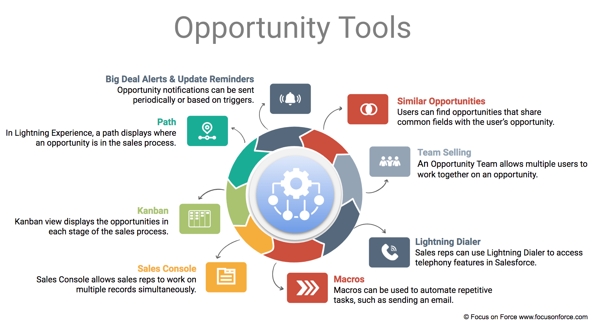

<h3> Given a scenario, identify the appropiate sales productivity feature using opportunity tools and know when products and Price Books should be used </h3>

### Opportunity tools:

### Path:

* Display where an Opportunity is in the Sales Process, what status is in, or the status process for any ony object.
* Paths can be defined per record type.
* It's only available in Salesforce Classic.

### Kanban:

* Visually displays Opportunities in each stage.
* Available on standard and custom object that have picklist.
* Only available in Lightning Experience.

### Sales console :

* Custom app that allow working on multiple related records in one dashboard interface.
* Subtabs are used for selecting the type of records and to work with multiple records.
* There is the Highlights Panel which can display up to 4 key fields from a record.
* Macro functionality is available to automate steps applied to a record.

### Macros:

* Can be used to automate task.
* Macros work on all objects that allow quick actions and have customizable page layout.
* Some macro instructions are:
  * Quick text.
  * Email templates.
  * Attachments.
  
### Lightning Dialer:

Can be utilized by sales reps to access telephony features without leaving Salesforce. For example:
* Call.
* Call recording.
* Call Monitoring.
* Voicemails.
* Call Brigde.

### Opportunity Workspace:

Feature that provides a view of all information related to an Opportunity. It contains:
1. Opportunity Sales Path.
2. Key Fields defined for the Opportunity Stage.
3. Guidance defined for the stage.
4. Tabs for creating Calls, Task, Events, using Chatter features or accessing the record details.
5. Display Open Task or Upcoming Events and Complete Task and Past Events.
6. Display Opportunity related information.

