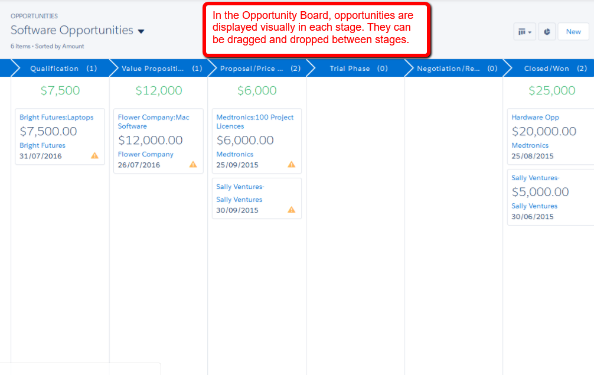

<h3> Given a scenario, identify the appropiate sales productivity feature using opportunity tools and know when products and Price Books should be used </h3>

### Path:

* Display where an Opportunity is in the Sales Process, what status is in, or the status process for any ony object.
* Paths can be defined per record type.
* It's only available in Salesforce Classic.

### Kanban:

* Visually displays Opportunities in each stage.
* Available on standard and custom object that have picklist.
* Only available in Lightning Experience.

### Sales console :

* Custom app that allow working on multiple related records in one dashboard interface.
* Subtabs are used for selecting the type of records and to work with multiple records.
* There is the Highlights Panel which can display up to 4 key fields from a record.
* Macro functionality is available to automate steps applied to a record.

### Macros:

* Can be used to automate task.
* Macros work on all objects that allow quick actions and have customizable page layout.
* Some macro instructions are:
  * Quick text.
  * Email templates.
  * Attachments.
  
### Lightning Dialer:

Can be utilized by sales reps to access telephony features without leaving Salesforce. For example:
* Call.
* Call recording.
* Call Monitoring.
* Voicemails.
* Call Brigde.

### Opportunity Workspace:

Feature that provides a view of all information related to an Opportunity. It contains:
1. Opportunity Sales Path.
2. Key Fields defined for the Opportunity Stage.
3. Guidance defined for the stage.
4. Tabs for creating Calls, Task, Events, using Chatter features or accessing the record details.
5. Display Open Task or Upcoming Events and Complete Task and Past Events.
6. Display Opportunity related information.

### Product Schedules:

A product can be associated with a revenue or quantity schedule.

* Revenue schedule: Can be used if customer make regular pauments but receive the product once.
* Quantity schedule: Can be used if customer pay once but receive the product in increments. For example a magazine.

### Price Book:

* Is a group of products and their associated prices
* A Price Book entry is an individual product and its associated price.
* Use standar Price Books if only one price is needed for all customers.
* If price vary for different customers, custom Price Books can be added.
* Products must have a standard price defined in the standard price book to be available to add to an opportunity.
* Products can only be added from a single Price Book.
* Changing a selected Price Book will delete all existing products from the opportunity.

### Big Deal Alert:

* Can be used to send notifications when an Opportunity of a certain value reaches a trigger probability and trigger amount.
* The alert will trigger when the Opportunity reaches the trigger probability but will not send again if it goes higher.
* An alert will be sent again if the probability drops below the trigger and reaches it again.

### Similar Opportunities.

* Use Match criteria based on 3- 10 opportunity fields or related list can be determine how to find similar opportunities.
* Only available in Salesforce Classic.

### Opportunity Competitors: 

* Allow one or more competitor and their strengths and weakness to be listen on an Opportunity.
* Picklist value for Competitors must be defined, and it's only available in Salesforce Classic.
