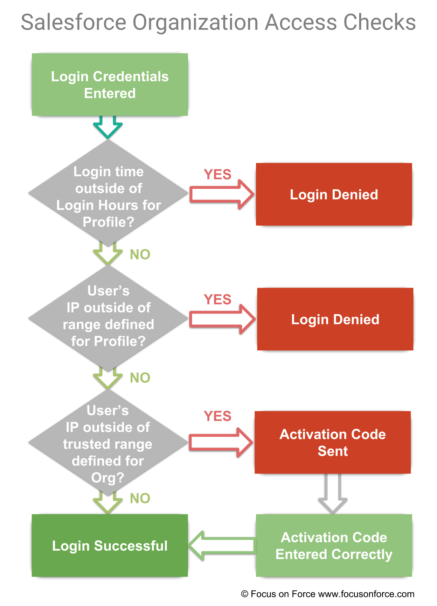
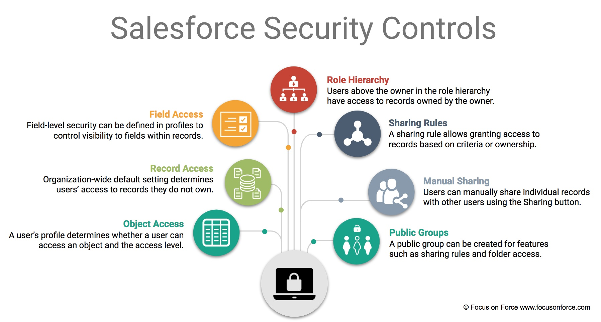
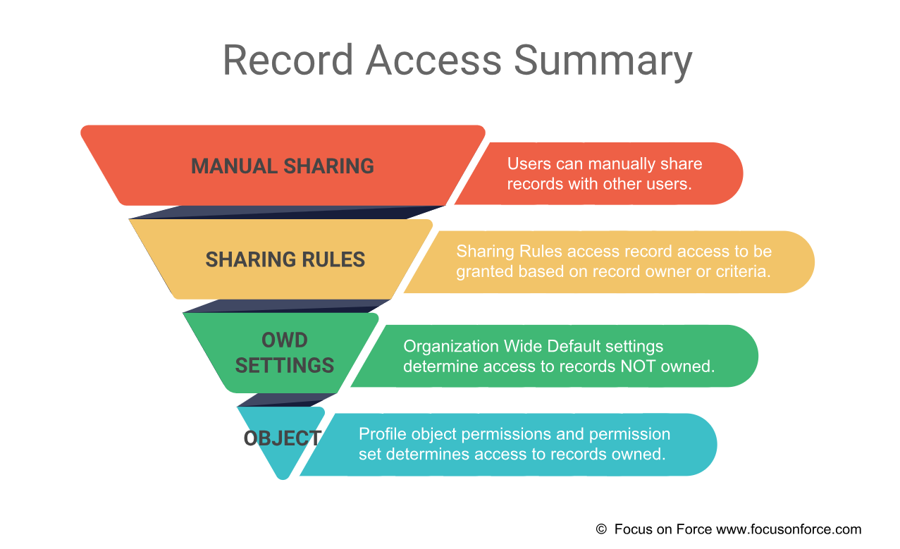

# Security and Access

### Passwords:
* **Password Policies:** 
    * Can be set at an organization or profile level.
    * Override the Organization-Wide Password Policies for that profile’s users.
    * Password can’t contain a user’s username and can’t match a user’s first or last name.
    * There are default password requirements for new organizations, and they can be modified(except for Personal Edition).
* **Password Expiration:** Passwords can expire for all users except for those with the ‘Password Never Expires’ permission(default is 90 days).
* **Resetting Passwords:** User’s password can be reset for better protection or to unlock a user who has been locked out.

### IP Restriction:
* IP restrictions for users can be specified at the profile level and the organization level.
* Login IP address restrictions can be defined for a profile.
* A list of trusted IP addresses can be defined for the entire organization.
* When a user is denied access, they see the same error message that appears when the username or password is incorrect.
* It is possible to enforce login IP ranges on every request for all user profiles with IP restrictions by selecting an option in ‘Session Settings’.

### Organization-Level Trusted IP Ranges:

### Login Hours:
* Can be set at the profile level but not the organization level to restrict when users can log in. It's possible to set the days and hours when users with the profile can log in to the organization.
* If a user tries to login outside of these hours, they are denied access. When a user is denied access, they see the same error message which appears when the username or password is incorrect.

# Salesforce Security Controls

### Object Access
* Profiles determine which objects a user can access and what actions they can take on those objects.
* Permission on objects can be set to ‘Read’, ‘Create’, ‘Edit’, ‘Delete’, or ‘View All’ / ‘Modify All’. View All and Modify all grants access to all records of the object and overrides sharing settings.
* Profiles determine access to tabs and apps.
* Tab Setting ‘Default On‘ means the tab for the object will be in the navigation bar if it is part of the ‘App’ selected.
* Tab Setting ‘Default Off‘ means that it is available for the user to add by customizing tabs.
* Tab Setting ‘Tab Hidden‘ means the tab will not be visible for the object.

### Record Access
* Object permissions (Create, Read, Edit, Delete) control what users can do with records they own.
* Organization-wide defaults (OWD) determines access to other users' data for records they do NOT own.
* OWD settings do not grant more access than the object access granted in the user’s profile.
* Changing OWD settings and increasing default access (e.g., from Public Read Only to Public Read/Write) will take effect immediately.
* Changing OWD settings and decreasing default access in an existing organization with significant data will take some time for Salesforce to recalculate user access.

### Field Access
* Field-level security controls visibility to data within records at the field level.
* Fields can be set to not visible or read-only based on profile.
* Read-only field-level security will override the ‘Edit‘ permission on the object.
* Field-level security will override the ‘Modify All Data‘ and ‘View All Data‘ permissions.
* Field-level security does not prevent searching on the values in a field.
* Universally required fields override field-level security and will appear on edit pages regardless of field level security.

### Role Hierarchy Access
* The role hierarchy grants access to records to users that have a role above the record owner in the role hierarchy.
* The role hierarchy allows additional record access when the object OWD setting is set to more restrictive than Public Read/Write, e.g., Private/Public Read-Only.
* The role hierarchy is not an organization hierarchy. It should be thought of as a data access hierarchy.
* Role hierarchy access does not override object access determined by profiles. For example, if the role hierarchy setting for Opportunities is set to Edit, but the users' profile object permission for opportunities doesn’t have Edit, they will not be able to Edit opportunities.
* Exact access to contact, opportunity and case records can be specified. Access can be set to No Access, View or Edit access. These options only appear depending on the OWD settings of the object; they will not appear if the OWD setting is public.
* Access to records of custom objects via the role hierarchy can be disabled by unchecking 'Grant Access Using Hierarchies'. This setting is always enabled for standard objects and cannot be disabled.

### Manager Group Access
* Manager groups allow users to share records up or down their management chain.
* Once enabled, users can share records with their managers or manager subordinate groups.
* Manual sharing, sharing rule, or Apex managed sharing can be used to share records with a manager group or manager subordinates group.

### Manual User Sharing and Standard Report Visibility
* The Sharing button on user detail pages enables a user to grant others access to the user’s own user record.
* It is possible to control the visibility of standard reports that might expose data of users to whom a user doesn’t have access by selecting the 'Standard Report Visibility' checkbox. Selecting the 'Standard Report Visibility' checkbox allows users to view reports based on standard report types that can expose data of users to whom they don’t have access.

### Sharing Rules
* Sharing rules allow record access to be granted to other users based on their role, territory, public group membership or manager groups, that they wouldn’t normally have access to according to the organization-wide sharing settings.
* Records to be shared can be based on record owner or record criteria, e.g., record type.
Access granted can be ‘Read Only’ or ‘Read/Write’.
* Sharing rules for campaign members can inherit from lead and contact rules or from the campaign.
* If a sharing rule allows a user to view or edit certain records but the user's profile does not give them ‘read’ access to the object, then the user will not be able to access the records associated with the sharing rule. 
* A profile determines at the base level what can be done with the records of a certain object, while a **sharing rule opens up access to the records of the object**. 

### Manual Sharing

* Salesforce Classic only feature. Can be disabled with the ‘Manual User Record Sharing’ checkbox on the Sharing Settings page.
* To manually share a record, the user must be the owner of the record, above the owner in the role hierarchy, a user with ‘full’ access, or an administrator.
* A user with full access can view, edit, delete and transfer a record. The user can also extend sharing access to other users but cannot grant full access to the users.

## Record Access Summary:
* Record access in Salesforce is based on the concept of opening up record access from more restrictive to less restrictive.
* Access to objects is first defined at the object level for a user profile for records the user owns.
* Organization-wide default settings open up access to records the user does not own for specific objects.
* Sharing rules open up record access to users when the OWD settings are set to anything more restrictive than Public Read/Write.
* Individual records can be manually shared using the ‘Sharing’ button

### Public Groups
* Administrators can create Public Groups.
* Public Groups are used for Sharing Rules, Folder access, Sharing Records, and adding Users to a Content Library.

### Additional Sharing Options
* **List views** can be shared with All Users, Roles, Public Groups, Roles & Subordinates, Territories, and Territories & Subordinates.
* **Queues** can consist of Public Groups, Users, Roles, Roles & Subordinates, Territories, and Territories & Subordinates.

# Profiles and permission sets

### Standard Profiles
* Standard profiles (permissions) cannot be edited but can be cloned.
* Profiles include App settings and System Settings. App Settings include settings that are specific to apps and objects.
* System Settings include settings that apply to all apps, such as security settings and overall data visibility.
* Standard Profiles Examples
    * **Standard User:** Create, Read, Edit and Delete to most objects, Run Reports, View Org Setup, View but not manage campaigns, Create but not review solutions.
    * **Solution Manager:** Standard User + Review and Publish solutions.
    * **Marketing User:** Standard User + Import Leads, Manage Campaigns, Create Email Templates, Manage Public Documents.
    * **Contract Manager:** Standard User + Manage Contracts.
    * **Read Only:** View but not edit records, run reports, view organization setup.
    * **System Administrator:** Access to all functionality that doesn’t require an additional license. Configure and customize the application. Can View and Modify all Data, which overrides all sharing rules.

### Custom Profiles
* Custom profiles can be created to fully customize.
* Custom profiles are not available in Contact Manager and Group Editions.
* Custom profiles are created by cloning an existing profile.

### Profile Settings
* Settings are object-based. Gives the ability to allow read, create, edit, delete of modify all.
* Determines which page layout a profile uses.

### Profile Permissions
* Used to grant or remove App, Custom or System Permissions. App permissions control what actions can be performed in different apps.
* Custom permissions must be enabled.

### Permission Sets
* Used to expand user privileges beyond what their profile allows.
* Can only be used to increase privileges, not remove.
* Users can be assigned one or more permission sets.
* Multiple users can be assigned to a permission set using a user list view.

# Salesforces Folders

### Folder Management
* Folders are used to store and organize reports, documents, dashboards and email templates.
* Folders do not follow organization-wide defaults or the role hierarchy for sharing access.
* Different user permissions are required to manage folders (create, edit and delete).
User Permissions Needed
* Folders may be searched from Global Search.
* Folders can now be favorited and appear in the “All Favorites” list in Reports and Dashboards.

### Report and Dashboard Folders in Lightning Experience
* Subfolders can be used to organise reports and dashboards into a logical structure
* Folder sharing is at the root level, not subfolder level
* Subfolders can be created in user created folders, but not in the Public or Private folder
* Folders can be renamed or deleted (if it doesn't contain any reports or dashboards)
* The subfolder hierarchy can be 3 levels, for example:
