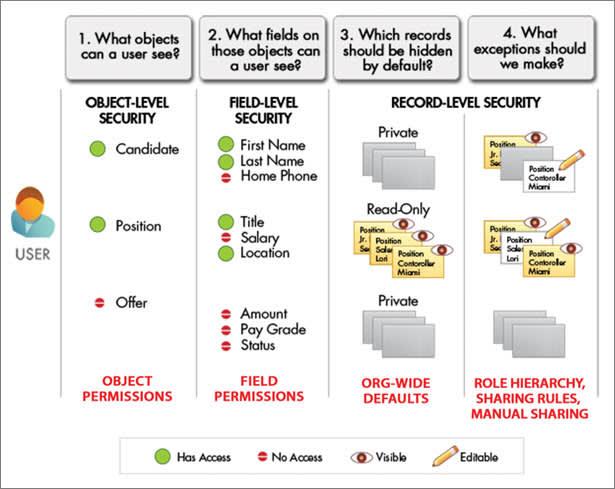
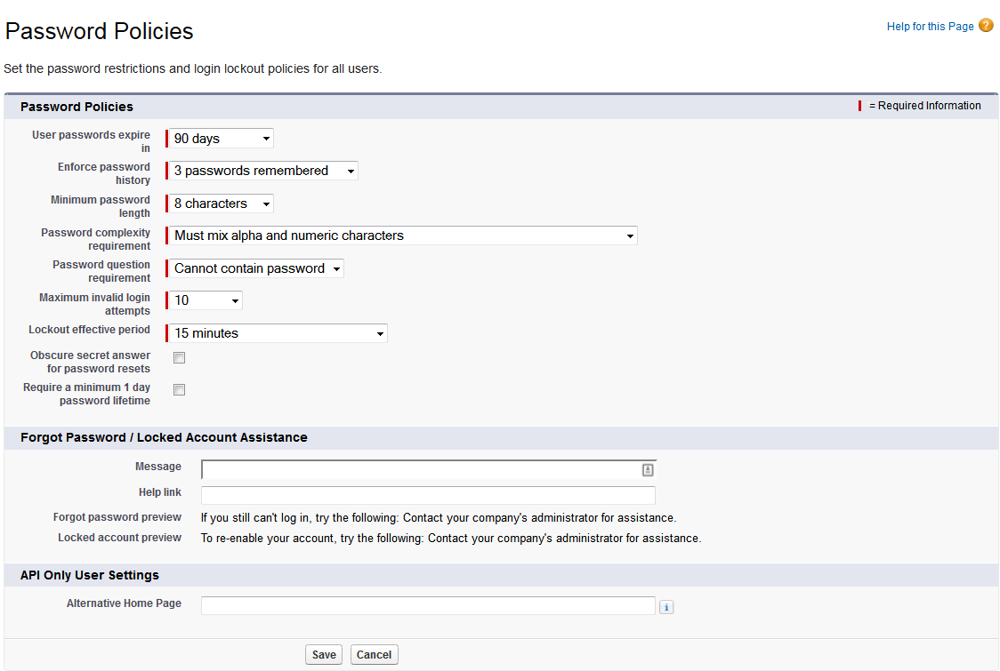

# Data Security

### Set Password policies

### Access layers

* Organization access
* Object access
* Record access
* Field access

### Object-Level Security (Permission Sets and Profiles)
Object-level security—or object permissions—provide the bluntest way to control data. Using object permissions you can prevent a user from seeing, creating, editing, or deleting any instance of a particular type of object, such as a lead or opportunity. Object permissions let you hide whole tabs and objects from particular users, so that they don’t even know that type of data exists.
You specify object permissions in permission sets and profiles. Permission sets and profiles are collections of settings and permissions that determine what a user can do in the application, similar to a group in a Windows network, where all of the members of the group have the same folder permissions and access to the same software.
Profiles are typically defined by a user’s job function (for example, system administrator or sales representative). A profile can be assigned to many users, but a user can be assigned to only one profile. You can use permission sets to grant additional permissions and access settings to users. It’s easy to manage users’ permissions and access with permission sets, because you can assign multiple permission sets to a single user.

### Field-Level Security (Permission Sets and Profiles)
In some cases, you may want users to have access to an object, but limit their access to individual fields in that object. Field-level security—or field permissions—control whether a user can see, edit, and delete the value for a particular field on an object. They let you protect sensitive fields without having to hide the whole object from users. Field permissions are also controlled in permission sets and profiles.
Unlike page layouts, which only control the visibility of fields on detail and edit pages, field permissions control the visibility of fields in any part of the app, including related lists, list views, reports, and search results. To ensure that a user can’t access a particular field, use field permissions. No other settings provide the same level of protection for a field.

### Record-Level Security (Sharing)
After setting object- and field-level access permissions, you may want to configure access settings for the actual records themselves. Record-level security lets you give users access to some object records, but not others. Every record is owned by a user or a queue. The owner has full access to the record. In a hierarchy, users higher in the hierarchy always have the same access to users below them in the hierarchy. This access applies to records owned by users, as well as records shared with them.
To specify record-level security, set your organization-wide sharing settings, define a hierarchy, and create sharing rules.

* Organization-wide sharing settings—The first step in record-level security is to determine the organization-wide sharing settings for each object. Organization-wide sharing settings specify the default level of access users have to each others’ records.
You use organization-wide sharing settings to lock down your data to the most restrictive level, and then use the other record-level security and sharing tools to selectively give access to other users. For example, let’s say users have object-level permissions to read and edit opportunities, and the organization-wide sharing setting is Read-Only. By default, those users can read all opportunity records, but can’t edit any unless they own the record or are granted additional permissions.

    
