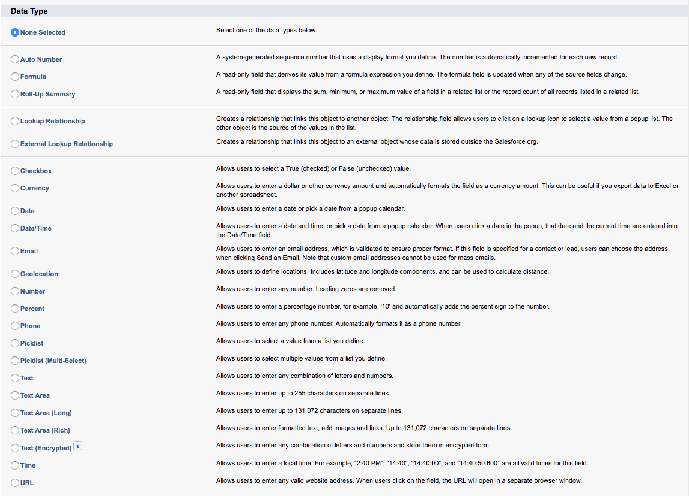
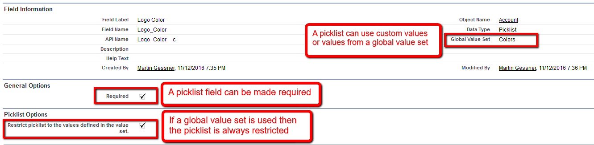
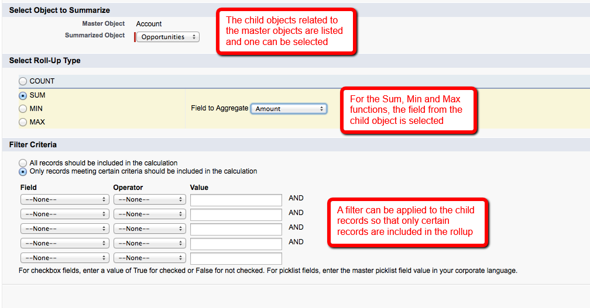
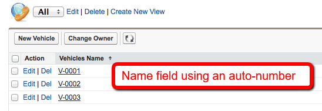
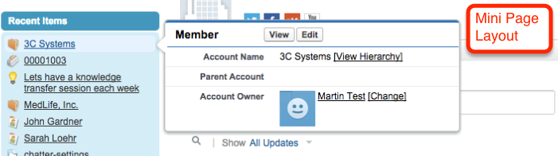
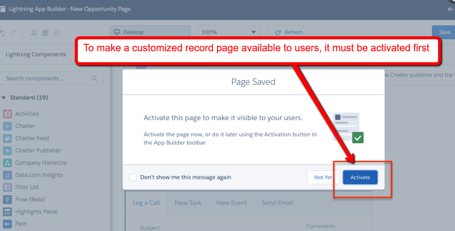

<h1> Customization for Standard Fields and Custom Fields

### Cusomization for Standard Fields: 

* Fields labels can be change.
* Lookup Filters can be added or edited.
* Can be removed from Page Layouts.
* Can not be deleted.

### Custom Fields: Are use to store additional data in objects

Custom fields can be: Default, unique, required, case sentitive, and time fields.
  

### Picklist: 

* Can be custom defined values or values from a global value set. If a global set is used, then the picklist is restricted. A restricted picklist means that only the values defined can be used. Other values cannot be inserted even via the API.
* If a value is imported into a picklist that doesn't exist and the picklist is not restricted, it will be added.
* A picklist value can be deactivated.

### Dependent picklist:

* Allows one Picklist to be filtered by the values in another Picklist or checkbox field.
* The picklist that drive the filtering is called the controlling field, and the picklist that has its values filtered is called dependent field.

It's important to have in mind that:

* Dependent list can be multi-select.
* Standard picklist fields can be controlling fields but not dependent fields.
* Custom object picklist fields can be controlling or dependent.

### Global Value Set:

* Allow picklist values to be shared across the fields and objects.
* Global picklist(picklist that use a global value set) are always restricted.
* Global value set can be used in picklist dependencies.

### Changing Field Types:

* Field type of custom fields can be change, but data loss can occur in field types change. For example: Changing to Number or to Percent from any type.
* List of potential data loss:
  * Changing to or from type Date or Date/Time.
  * Changing to Number from any other type.
  * Changing to Percent from any other type.
  * Changing to Currency from any other type.
  * Changing from Checkbox to any other type.
  * Changing from Picklist (Multi-Select) to any other type.
  * Changing to Picklist (Multi-Select) from any other type.
  * Currently defined picklist values are retained when you change a picklist to a multi-select picklist. If records contain values that are not in the picklist definition, those values are deleted from those records when the data type changes.
  * Changing from Auto Number to any other type
  * Changing to Auto Number from any type except Text.
  * Changing from Text to Picklist.
  * Changing from Text Area (Long) to any type except Email, Phone, Text, Text Area, or URL.

### Record ID Field: 

 * The Record ID Field is generated when the record is created.
 * Every record has it´s own 15 character case sensitive identifier. The API defaults to using 18 character case insensitive records IDs.
 * This field is not displayed on the records detail page but the ID can be found in the URL.
 
### External IDs: 

 * External IDs are fields that contain a unique identifier from a system outside of Salesforce.
 * There ca be up to 25 external IDs on one object.
 
### Roll-up Summary Fields:

 * Rollup summary fields are defined on the master object and available for certain object relationships such as:
  * Standard to custom.
  * Custom to custom.
  * Custom to certain standard relationships.
 * Rollup summary fields values take up to 30 minutes. It can be performed manually by using the selecting the 'Force a mass recalculation on this field'.
 
 
 
 ### Formula Fields:
 
 * Formula fields are read-only fields that automatically calculate a value based on other fields or a formula. They are automatically update when one of the fields used in the formula changes.
 * Formula fields can be:
  * Simple: Allow selection of one or more fields and operators, suchs as Add, Subtract, and Concatenate.
  * Advanced: Allow selection of one or more fields, operators and advanced functions.
 * Formula field can be: Checkbox, Currency, Date, Date/Time, Number, Percent or Text.
  
### Deleting Fields:

 * Standard fields cannot be deleted.
 * Custom fields can be deleted. The data contained in the fields will also be deleted.
 * A custom field cannot be deleted if it's referenced elsewhere.
 * A deleted field can be restored if it has not been permanently deleted or within 15 days. After that Salesforce will permanently delete it. Deleted custom fields count against custom field allocation within 15 days after deletion.
 * After a field is restor, field history is available again. If the restored fields was part of a master-detail relationship, it will be restore as a lookup. It needs to be converted to master-detail
 
 ### Custom objects: 
 
  * Can ce created to record custom data not covered by standard objects.
  * Up to 200 custom object can be created in Enterprise edition and up to 2000 in Unlimited and Performance edition.
  * Record name must be configured when creating a new object.
  * The record name can be a text field or auto-number.
  * The record name appears in Page Layouts, List Views, Related List, Lookups, and Search Results.
  * Custom object options: Allow reports, Allow Activities, Allow Track Field History.
  

### Apps: 

Apps are a collection of tabs made visible to certain profiles. Type of apps:
 * Standar Apps: Sales, Service, Marketing, etc.
 * Custom Apps.

### Tabs:

 * When creating a custom object, a new tab must be created to be able to create records via the user interface. Tabs can be standard or custom. 
 * Web tabs will embed a web page within Salesforce Tabs.
 
 ### Page layouts:
 
 * Page layouts control the layout and organization fields, buttons, links , reports, etc.
 * Page layouts allow fields to be marked as read-only or required.
 * Fields displayed, sort order and buttons in the related list can be controlled in the page layout.
 * Sections can be used to organize fields on the page.
 * Different page layouts can be assigned to different profiles so that each type of user can see the fields that are relevant.
 * When a custom record page is created in Lightning Experience, it must be activated before it becomes available to any user.
 * Mini page layout controls the fields that are displayed when hovering a record.
 

 
 

 
