<h1> Standard Object </h1>

### Standard Objects: 

* No se pueden borrar, sin embargo, se pueden ocultar a los usuarios. 

* Se puedes customizar añadiendo campos, cambiando el page layouts y creando relaciones a otros objetos. 

* Algunos ejemplos de Standard Objects: Accounts, Contact, Activities, Opportunities, and Leads. 

### Standard Object Architecture and Relationship Model: 

… 

### Ejemplos de relationships: 

* Una Account puede ser relacionada con 0,1 o N Contacts. 

* Un Contact puede ser relacionada con varias Opportunities. 

* Un Opportunity sin embargo solo puede relacionarse con una cuenta. 

* Accounts y Opportunity tienen un lookup relationship en Salesforce, esto permite que se cree una oportunidad sin especificar el Account Record. Sin embargo, se comporta también como una relación Master-Detail, esto hace que si por ejemplo se borra una Account se borrarían también todas las oportunidades relacionadas. 

### Diagrama de relationships: 
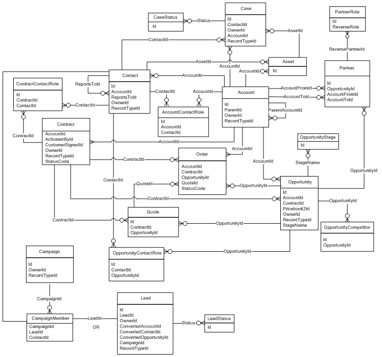

### Campaign and Campaign Members: 

Una campaña está formada por diferentes Campaign Members y estos Campaign Member puede ser Lead o Contacts. 

### Lead Conversion: 
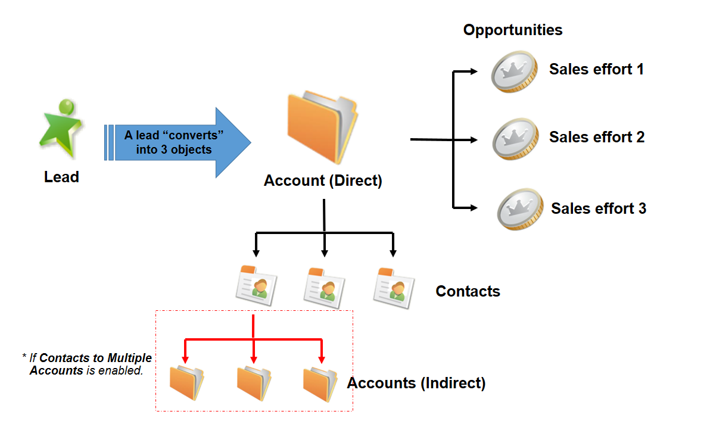

### Account to Calendar Events and Task and Activities
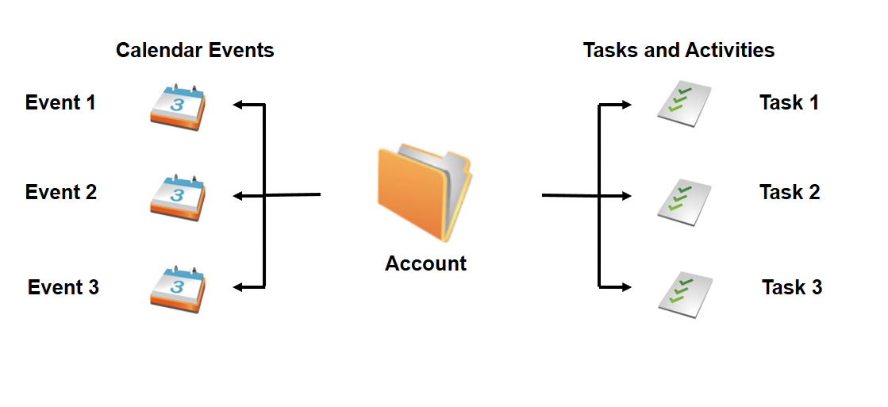

### Contact to Calendar Events and Task and Activities
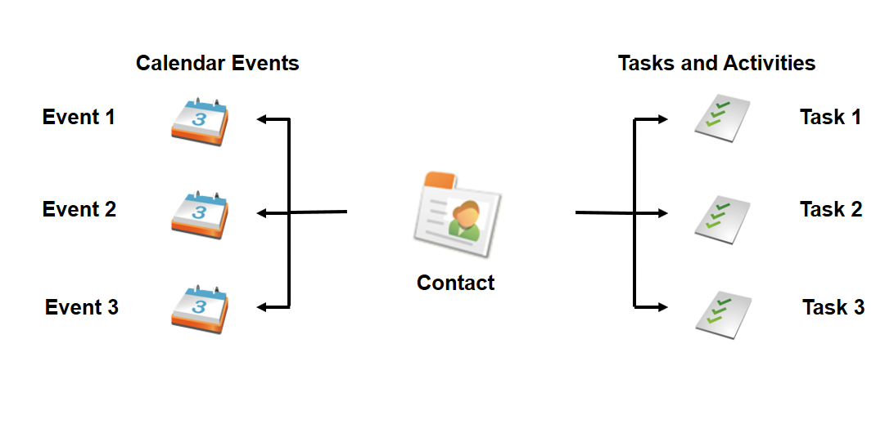

### Contract to Orders and Case to Solutions
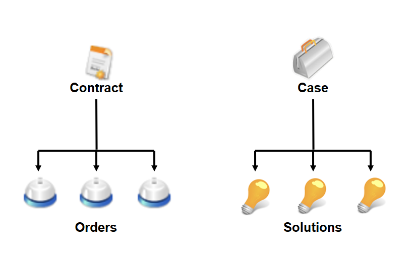

### Product to Assets and Price Books
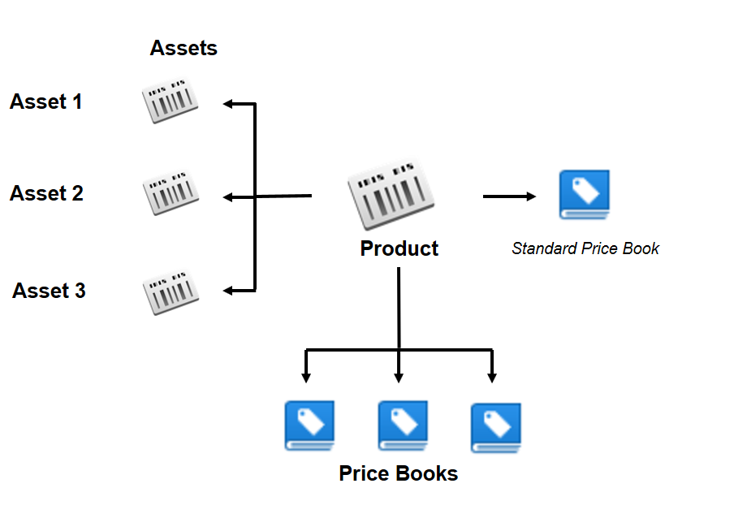

### Product to Assets and Price Books

### Opportunity to Quote, Pirce Book, and Opportunity Products
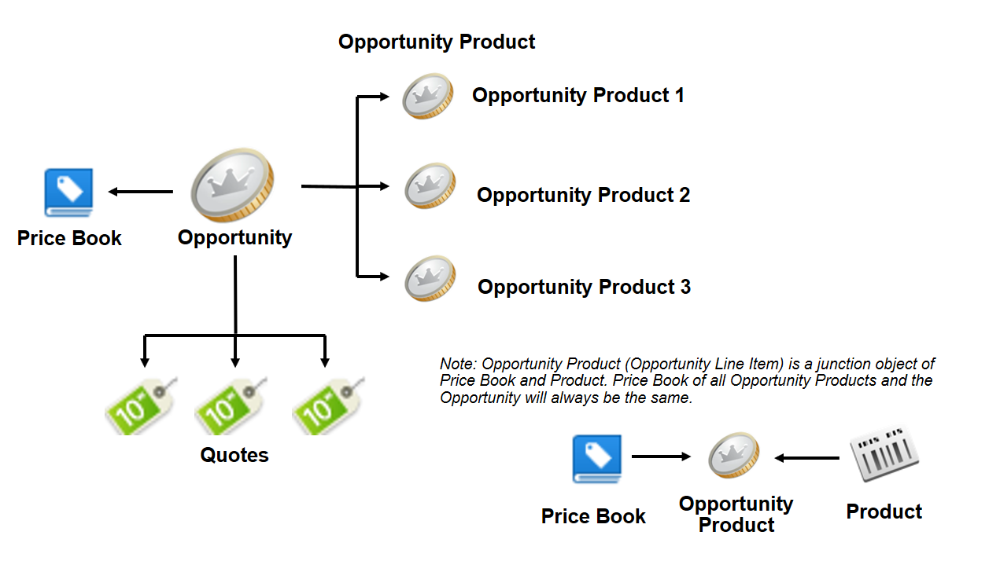

### Contact to Case, Work Orders, and Work Order Line Items
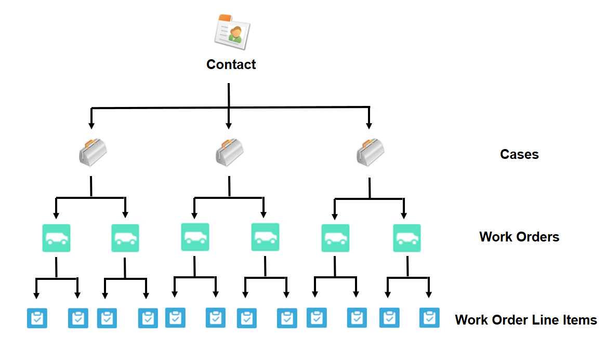

### Account and Contract to Order
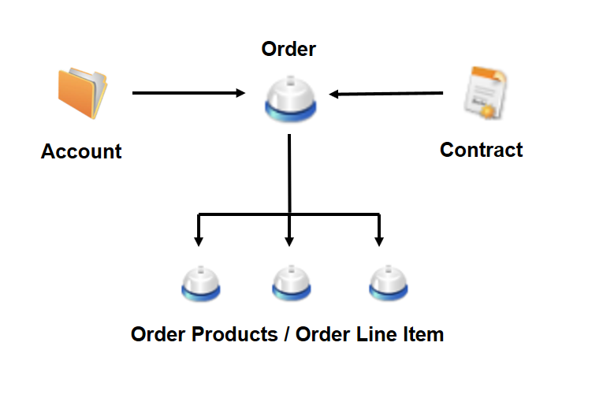

### Work Orders:
* Sirve para seguir reparaciones y mantenimiento
* Se pueden asociar con Accounts, Assets, Cases, Contacts, Entitlements, Service Contracts.
* Una work order se puede asociar con otra a traves de Parent Work Order

### Relationship Types:
* Relaciones se usan cuando se quieren relate un record con otro objeto.
* Relaciones pueden ser creadas entre objetos estandar y custom object o entre dos custom objects

### Lookup Relationships:

### Master-Detail Relationships:

###  Many-to-Many Relationships:

### Example Lookup, Master-Detail and Many-to-Many Relationships
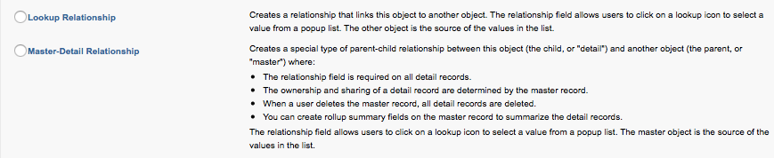

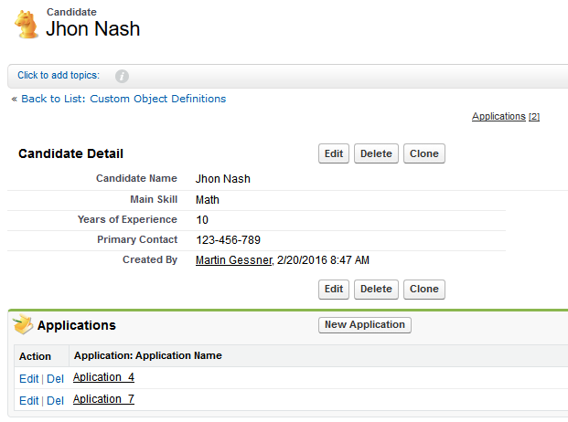
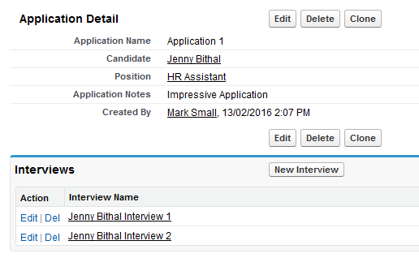
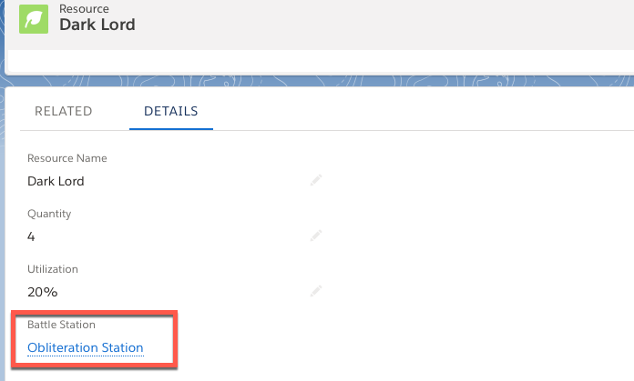

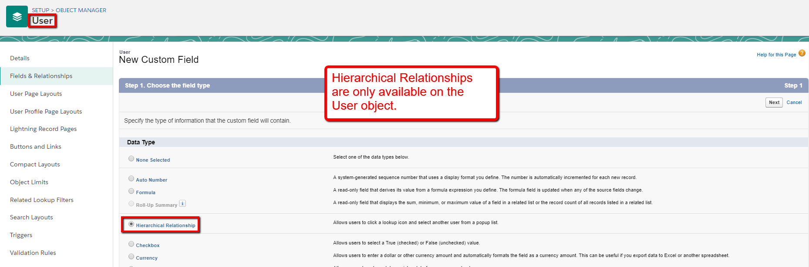
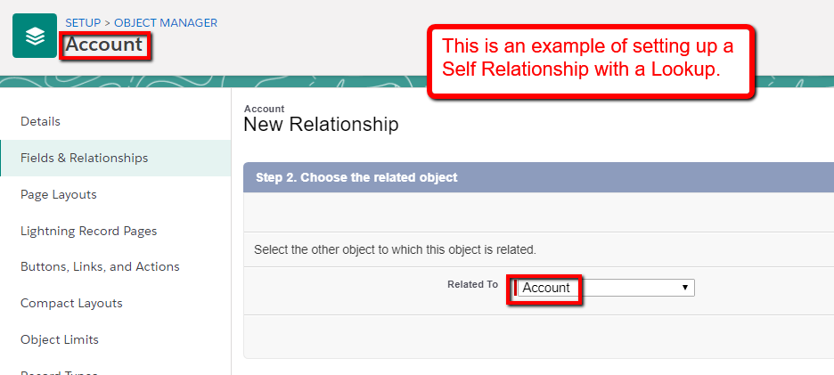
