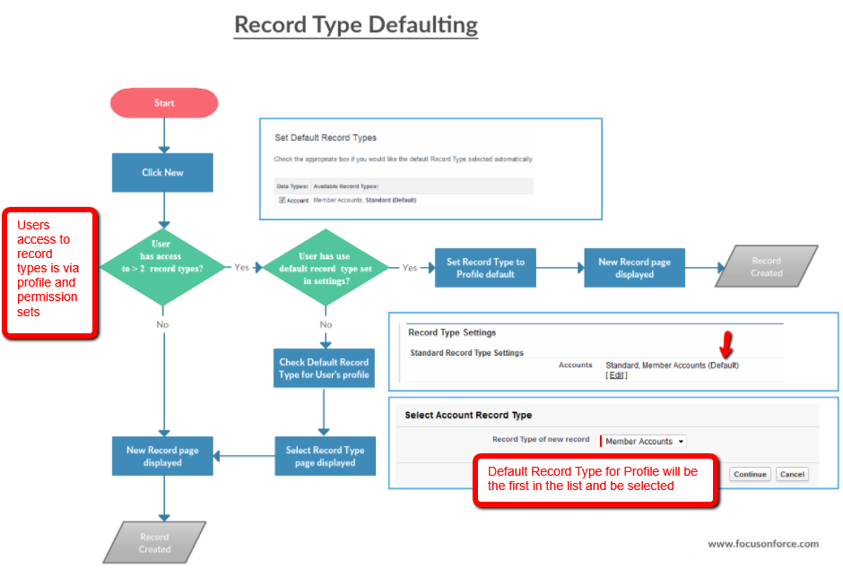
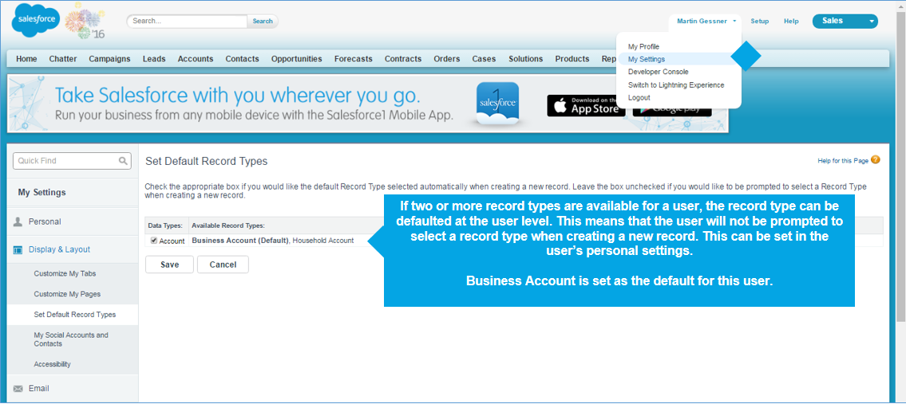
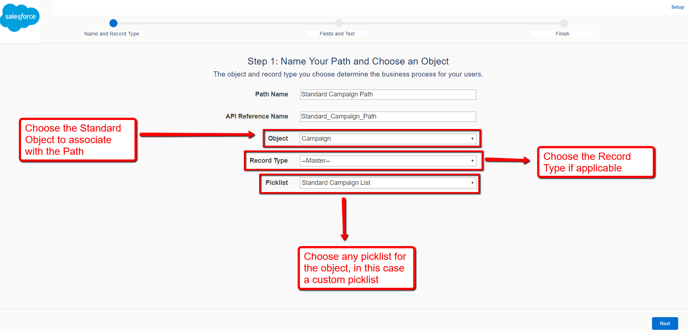
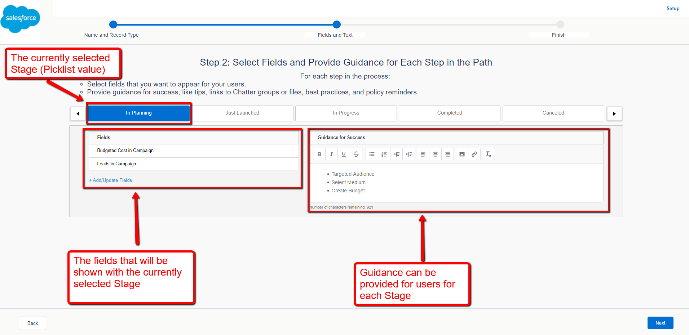
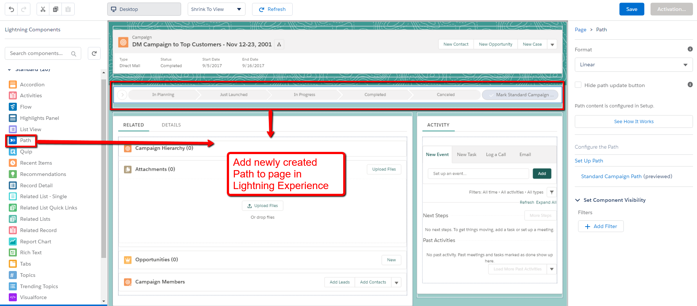

<h1> Given a scenario, determine how to create and assign page layout, record type and business processes </h1>

### Record type:
 * Record type allow different picklist values, page layouts and business processes to be defined for an object, standard or custom.
 * Can be used when one object is used for different purpose.
 * Each object has a defult record master record type that is hidden.
 * A record type is assigned one page layout type per profile.
 * Assigning a record type to a profile gives the user the ability to create records of that record type.
 
 ### Record type assignment:
  
  * Record type can be assigned to a profile or individual user through permission set.
  * In Profiles, page layouts assignments are specified for every record type, even whe a record type is not available to that profile.
  * User can view records assigned to any record type.
  * Page layout assignments are specified in Profile only.
  * When a permission set specifies a custom record type, the users assigned with that permission set gets the page layout that is specified for that record type within their profile.
  * How to Create a Record Type:
    1. Create page layouts to be used for record types.
    2. Add any additional picklist values.
    3. Create record type record.
    4. Assign record type to profile.
    5. Assign page layout for eacht profile for each record type.
    6. Select picklist values for a record type.
  * Record type defaulting:
    * Record type is set at profile level, and this is used when creatng a new record. It can be changed.
    * User can set a default record type in their personal settings.
    * Default record type is used when user doesn't select the record type.
  
  
  
  
### Business Processes:

 * Business Processes capture the life of leads, opportunities, cases and solutions.
 * Business Processes allow different picklist values to be related to record types for sales, lead, support and solution processes.

### Path:

 * Path are intended to capture the lifecycle of standard objects such as Leads, Campaigns, Accounts, Contacts and Case and are used to guide user along steps in a process.
 * A Path can be created for a custom object and certain standard object.
 * Path can be created from any picklist field on the standard object.
 * If a step has dependent fields, all dependent fields can be updated when updating a record from a path.
 * Each Record Type can have it's own Path.
 * For each stage on the Path, guidance and up to five fields can be displayed.
 * To enable and create a Path, search for Path Settings from Setup.
 
### How to create Path:

  
  
 
