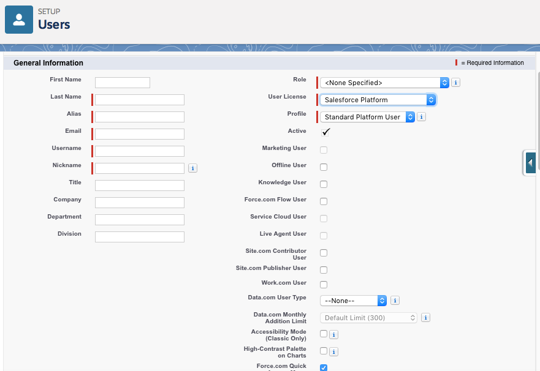
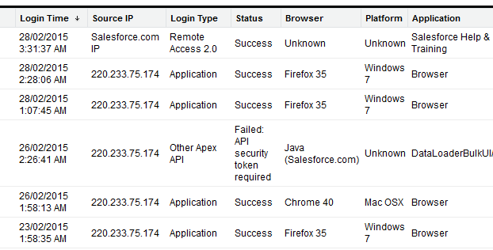

# User Setup 7%

## Manage Users

#### **Create one user:**
* Required Fields: Last Name, Alias, Email, Username, Nickname, User License, Profile.
* To complete the setup process, the user would have to click on the account verification link sent via email and create a password and security question.
* Users can't be deleted.

#### **Adding Multiple Users:**
* Up to 10 users can be added at a time.
* All users will have the same license assigned.
* The email and username will be the same when adding a user with this method. Individual user records will need to be edited after creation to choose further details

#### **Login History:**
* It shows up to 20K records.
* Can be viewed as a related list.

#### **Reset passwords:**
* Password can be reset by users, and administrator. An administrator can reset the password of multiple Users.
* Password can be reset on the Salesforce Mobile App
* Locked Users Accounts:  System administrator can unlock an account that has been locked due to too many failed attempts to access, or unfreeze an account that has been frozen previously.

#### **Delegated Administration:**
* The System Administrator can delegate certain administrative tasks to a delegated group.
* User in a deletage group can :
    * Create and edit users in specific profiles and roles.
    * Reset passwords for users in specific roles.
    * Assign users in specific roles to specific profilesn and specific public groups.
    * Manage specific custom objects.
    * Assign specific permission sets.

#### **User Access Common Issues:**
* Passwords are case sensitive.
* Account may be locked from too many failed login attempts.
* Trying to access org outside of business hours set by System Admin.
* IP restrictions.
* New user has not verified the account.

## Implications of activating, deactivating, or freezing a user

### Activating Users:
* Activating a user record enables the user to login and access to Salesforce.
* User records must start as Activated upon creation.
* Users can be Activated after being Deactivated.
* An email will be sent to the user with their username and account verification link.

### Deactivating Users
* Deactivating a user disables them from logging in and having access to Salesforce.
* Users cannot be deleted.
* Users cannot be deactivated if they are the sole recipient of a Workflow Email Alert, Customer Portal Administrator, or User selected in a Custom Hierarchy Field.
* Self Deactivation can be enabled to allow external Community and Chatter users deactivate their own accounts.

### Freezing Users
* Freezing a user record can be used when steps to deactivate a user are incomplete.
* Freezing users is an immediate action.
* Freezing a user does not release their license. To release the license the user must be deactivated.

# Review:

#### Why would a user be freezed?
To prevent the user from logging in without deactivating them, allowing for changes to any customization where the user has been used (e.g. workflow email alerts)
